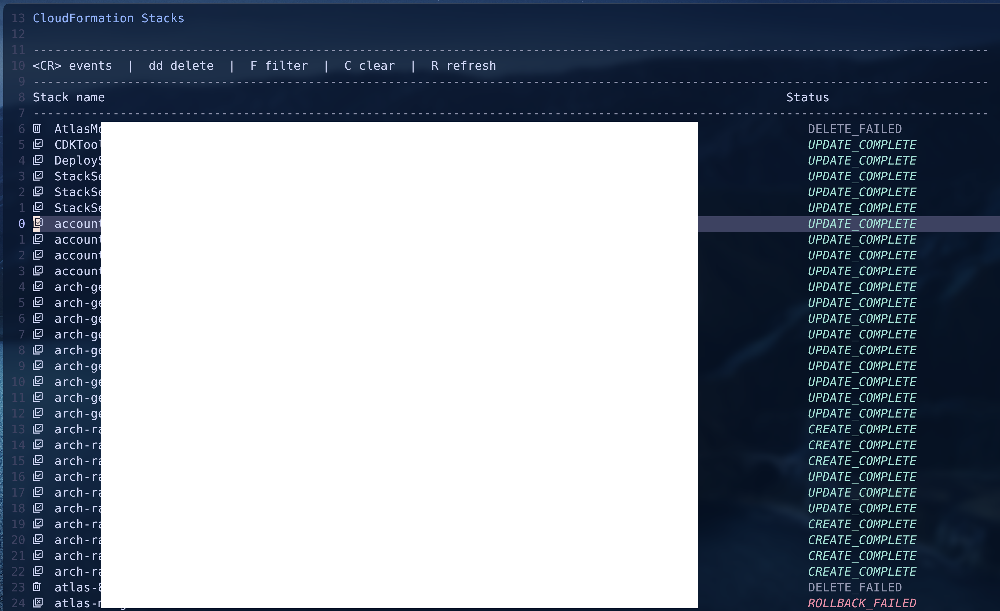
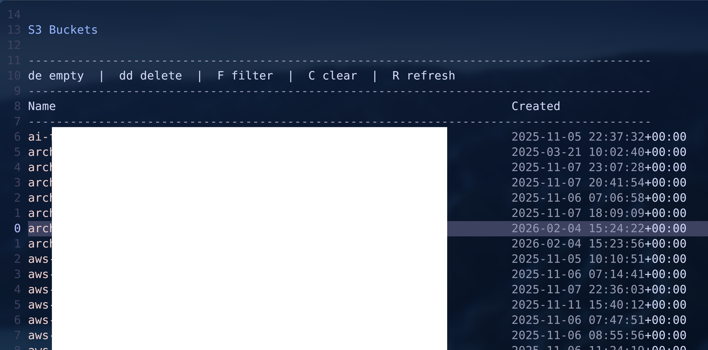
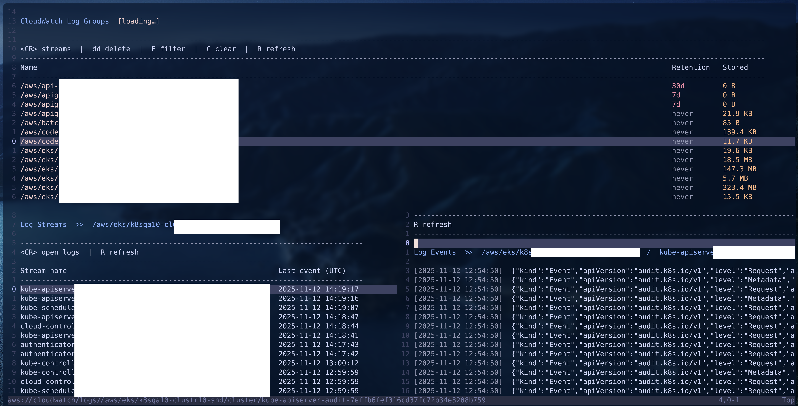

# aws.nvim

Manage AWS resources without leaving your editor. aws.nvim brings
CloudFormation stacks, S3 buckets, CloudWatch log groups, Lambda functions,
and ACM certificates directly into Neovim buffers — letting you browse,
filter, delete, and tail logs using the same motions and keybindings you
already know.

All AWS CLI calls run asynchronously, so the editor never blocks. Output lands
in standard `nofile` buffers, which means `/` search, `gg`/`G`, yank, and
every other built-in motion work out of the box.

Supported services:
- Aws Cloudformation
- Aws Cloudwatch
- Aws S3
- Aws Lambda
- Aws ACM (Certificate Manager)
- Aws Secrets Manager
- Aws CloudFront

## Screenshots

### CloudFormation



### S3



### CloudWatch



## Requirements

| Dependency | Version |
|---|---|
| Neovim | >= 0.9 |
| AWS CLI | v2 recommended |

Authentication is entirely delegated to the user. The plugin assumes the `aws`
binary is on `$PATH` and that credentials are already configured (environment
variables, `~/.aws/credentials`, SSO, IAM role, etc.). If a CLI call fails the
raw stderr output is shown verbatim in the buffer.

## Installation

### lazy.nvim

```lua
{
  "you/aws.nvim",
  config = function()
    require("aws").setup()
  end,
}
```

### packer.nvim

```lua
use {
  "you/aws.nvim",
  config = function()
    require("aws").setup()
  end,
}
```

## Configuration

All options are optional. Call `setup()` with any overrides:

```lua
require("aws").setup({
  -- Default AWS CLI environment overrides applied to every command.
  -- These are used when no per-command --profile / --region flag is given.
  -- Authentication must already be handled by your environment.
  default_aws_profile = nil,   -- sets AWS_PROFILE for every CLI call
  default_aws_region  = nil,   -- sets AWS_DEFAULT_REGION for every CLI call

  -- Status icons (requires a Nerd Font; replace with ASCII if needed)
  icons = {
      stack       = "󰆼 ",
      complete    = "󰱑 ",
      failed      = "󰱞 ",
      in_progress = "󰔟 ",
      deleted     = "󰩺 ",
  },

  -- Buffer-local keymaps for each service.
  -- Set any key to false to disable it entirely.
  keymaps = {
    cloudformation = {
      open_resources = "<CR>",   -- open resources for stack under cursor
      open_events    = "E",      -- open events for stack under cursor
      delete         = "dd",     -- delete stack under cursor
      filter         = "F",      -- prompt to filter stacks by name
      clear_filter   = "C",      -- clear active filter
      refresh        = "R",      -- re-fetch stacks from AWS
    },
    s3 = {
      open_bucket  = "<CR>",   -- open bucket in oil.nvim (oil-s3://)
      empty        = "de",     -- empty bucket under cursor (recursive rm)
      delete       = "dd",     -- delete bucket under cursor (must be empty first)
      filter       = "F",      -- prompt to filter buckets by name
      clear_filter = "C",      -- clear active filter
      refresh      = "R",      -- re-fetch buckets from AWS
    },
    cloudwatch = {
      open_streams = "<CR>",   -- open log streams for group under cursor
      open_logs    = "<CR>",   -- open log events for stream under cursor
      delete       = "dd",     -- delete log group under cursor
      filter       = "F",      -- prompt to filter log groups by name
      clear_filter = "C",      -- clear active filter
      refresh      = "R",      -- re-fetch from AWS
    },
    lambda = {
      open_detail  = "<CR>",   -- open detail view for function under cursor
      open_logs    = "L",      -- open CloudWatch log streams for function
      delete       = "dd",     -- delete function under cursor
      filter       = "F",      -- prompt to filter functions by name
      clear_filter = "C",      -- clear active filter
      refresh      = "R",      -- re-fetch from AWS
      detail_logs  = "L",      -- open CW log streams from the detail buffer
    },
    acm = {
      open_detail    = "<CR>",   -- open detail view for certificate under cursor
      delete         = "dd",     -- delete certificate under cursor
      filter         = "F",      -- prompt to filter certificates by domain
      clear_filter   = "C",      -- clear active filter
      refresh        = "R",      -- re-fetch from AWS
      detail_refresh = "R",      -- refresh the detail view
    },
    secretsmanager = {
      open_detail    = "<CR>",   -- open detail view for secret under cursor
      delete         = "dd",     -- delete secret under cursor (no recovery window)
      filter         = "F",      -- prompt to filter secrets by name
      clear_filter   = "C",      -- clear active filter
      refresh        = "R",      -- re-fetch from AWS
      detail_refresh = "R",      -- refresh the detail view
      reveal         = "gS",     -- toggle reveal/hide secret value in detail view
    },
    cloudfront = {
      open_detail       = "<CR>", -- open detail view for distribution under cursor
      invalidate        = "I",    -- prompt to create a cache invalidation
      filter            = "F",    -- prompt to filter distributions
      clear_filter      = "C",    -- clear active filter
      refresh           = "R",    -- re-fetch from AWS
      detail_refresh    = "R",    -- refresh the detail view
      detail_invalidate = "I",    -- create a cache invalidation from detail buffer
    },
  },
})
```

## Per-command flags

Every `:Aws*` command accepts optional `--region` and `--profile` flags that
override `default_aws_region` / `default_aws_profile` for that single
invocation. The flags can appear anywhere in the argument list.

```
:AwsCF list --region us-east-1
:AwsCF list --profile prod --region eu-west-1
:AwsS3 --region ap-southeast-1
:AwsCW list --profile staging
:AwsLambda list --region eu-west-1
```

Tab-completion is available for both flags and sub-commands.

---

## CloudFormation

### Commands

| Command | Description |
|---|---|
| `:AwsCF list` | Open the stacks list |
| `:AwsCF events <name>` | Open events for a specific stack |
| `:AwsCF delete <name>` | Delete a specific stack (with confirmation) |
| `:AwsCF --region <r> list` | Open stacks in a specific region |
| `:AwsCF --profile <p> list` | Open stacks with a specific profile |

### Stacks buffer (`filetype=aws-cloudformation`)

| Default key | Action |
|---|---|
| `<CR>` | Open resources for the stack under cursor |
| `E` | Open events for the stack under cursor |
| `dd` | Delete the stack under cursor (asks for confirmation) |
| `F` | Filter stacks by name |
| `C` | Clear active filter |
| `R` | Refresh the list |

All keys are configurable via `setup()` (see above).

### Resources buffer (`filetype=aws-cloudformation`)

Opened from the stacks buffer with `<CR>`. Fires two parallel AWS calls
(`list-stack-resources` + `get-template`) and renders the full resource tree.

**CDK stacks** are displayed as a hierarchical construct tree — folder nodes
mirror your CDK construct hierarchy, and leaf lines show `logical_id`,
`AWS::X::Y` type, physical id, and status side by side. Non-CDK stacks fall
back to a flat list. The title shows a `(CDK)` badge when CDK metadata is
detected.

**Folds** are pre-computed from the construct hierarchy, so `zc`/`zo`/`za`
collapse and expand entire CDK construct subtrees. The buffer opens fully
expanded (`foldlevel=99`).

**Highlights:** the `AWS::X::Y` type token uses the `AwsResourceType` highlight
group (linked to `Type` by default). Logical IDs that have a known AWS Console
URL are underlined via the `AwsResourceLink` highlight group.

| Default key | Action |
|---|---|
| `<CR>` | Open resource — `AWS::S3::Bucket` opens the bucket in oil.nvim; `AWS::Logs::LogGroup` opens CloudWatch log streams |
| `E` | Open events for this stack |
| `gx` | Open the AWS Console page for the resource under cursor |
| `R` | Refresh resources |

### Events buffer (`filetype=aws-cloudformation`)

| Default key | Action |
|---|---|
| `R` | Refresh events |

Standard Neovim motions (`gg`, `G`, `/{pattern}`, `n`, `N`, yank, …) work
because output lives in a normal `nofile` buffer.

---

## S3

### Commands

| Command | Description |
|---|---|
| `:AwsS3 list` | Open the buckets list (default when no sub-command given) |
| `:AwsS3 empty <name>` | Empty a bucket (delete all objects, with confirmation) |
| `:AwsS3 delete <name>` | Delete a bucket (bucket must be empty, with confirmation) |
| `:AwsS3 --region <r>` | Open buckets in a specific region |
| `:AwsS3 --profile <p>` | Open buckets with a specific profile |

### Buckets buffer (`filetype=aws-s3`)

| Default key | Action |
|---|---|
| `<CR>` | Open the bucket under cursor in oil.nvim (`oil-s3://`) |
| `de` | Empty the bucket under cursor (asks for confirmation) |
| `dd` | Delete the bucket under cursor (asks for confirmation; bucket must be empty) |
| `F` | Filter buckets by name |
| `C` | Clear active filter |
| `R` | Refresh the list |

All keys are configurable via `setup()` (see above).

Bucket regions are not shown in the list view to keep loading instant.
`list-buckets` returns in a single fast call; no per-bucket API calls are made.

---

## CloudWatch

### Commands

| Command | Description |
|---|---|
| `:AwsCW list` | Open the log groups list (default when no sub-command given) |
| `:AwsCW streams <group>` | Open log streams for a specific log group |
| `:AwsCW logs <group> <stream>` | Open log events for a specific stream |
| `:AwsCW delete <group>` | Delete a log group (with confirmation) |
| `:AwsCW --region <r>` | Open log groups in a specific region |
| `:AwsCW --profile <p>` | Open log groups with a specific profile |

### Log groups buffer (`filetype=aws-cloudwatch`)

| Default key | Action |
|---|---|
| `<CR>` | Open log streams for the group under cursor |
| `dd` | Delete the log group under cursor (asks for confirmation) |
| `F` | Filter log groups by name |
| `C` | Clear active filter |
| `R` | Refresh the list |

The list shows each group's retention policy and stored data size. All pages are
fetched automatically via `nextToken` pagination and rendered incrementally.

### Log streams buffer (`filetype=aws-cloudwatch`)

| Default key | Action |
|---|---|
| `<CR>` | Open log events for the stream under cursor |
| `R` | Refresh the list |

Opens in a vertical split alongside the log groups buffer. Streams are sorted by
last event time (most recent first).

### Log events buffer (`filetype=aws-cloudwatch`)

| Default key | Action |
|---|---|
| `R` | Refresh events |

Opens in a vertical split. Each event is prefixed with its UTC timestamp.
Multi-line messages are indented for readability.

All keys are configurable via `setup()` (see above).

---

## Lambda

### Commands

| Command | Description |
|---|---|
| `:AwsLambda list` | Open the functions list (default when no sub-command given) |
| `:AwsLambda detail <name>` | Open the detail view for a specific function |
| `:AwsLambda delete <name>` | Delete a function (with confirmation) |
| `:AwsLambda --region <r>` | Open functions in a specific region |
| `:AwsLambda --profile <p>` | Open functions with a specific profile |

### Functions buffer (`filetype=aws-lambda`)

| Default key | Action |
|---|---|
| `<CR>` | Open detail view for the function under cursor (vertical split) |
| `L` | Open CloudWatch log streams for the function under cursor |
| `dd` | Delete the function under cursor (asks for confirmation) |
| `F` | Filter functions by name (client-side, no extra API calls) |
| `C` | Clear active filter |
| `R` | Refresh the list |

The list shows each function's runtime, memory allocation, and code size. All
pages are fetched automatically via `Marker`/`NextMarker` pagination and
rendered incrementally as they arrive.

Visual-mode `dd` over a range of lines deletes all selected functions in
sequence after a single confirmation prompt.

### Detail buffer (`filetype=aws-lambda`)

Opened in a vertical split from the functions buffer with `<CR>`. Fetches the
full function configuration via `lambda get-function-configuration` and
displays:

- Runtime, handler, memory, timeout, code size, last modified, role
- Description and architecture (when present)
- VPC ID (when the function is VPC-attached)
- Environment variables (key → value table)
- Layers (full ARNs)
- CloudWatch log group link (`/aws/lambda/<function-name>`)

| Default key | Action |
|---|---|
| `L` | Open CloudWatch log streams for this function |
| `R` | Refresh the configuration |

The Lambda log group is always `/aws/lambda/<function-name>`. Pressing `L`
opens the streams buffer directly in a split without needing to navigate to
`:AwsCW` first.

All keys are configurable via `setup()` (see above).

---

## ACM (Certificate Manager)

### Commands

| Command | Description |
|---|---|
| `:AwsACM list` | Open the certificates list (default when no sub-command given) |
| `:AwsACM detail <arn>` | Open the detail view for a specific certificate |
| `:AwsACM delete <arn>` | Delete a certificate (with confirmation) |
| `:AwsACM --region <r>` | Open certificates in a specific region |
| `:AwsACM --profile <p>` | Open certificates with a specific profile |

### Certificates buffer (`filetype=aws-acm`)

| Default key | Action |
|---|---|
| `<CR>` | Open detail view for the certificate under cursor (vertical split) |
| `dd` | Delete the certificate under cursor (asks for confirmation) |
| `F` | Filter certificates by domain name (client-side, no extra API calls) |
| `C` | Clear active filter |
| `R` | Refresh the list |

The list shows each certificate's domain name, status (with icon), type
(`AMAZON_ISSUED` / `IMPORTED`), and expiry date. All certificate statuses are
shown by default (including `PENDING_VALIDATION`, `EXPIRED`, `REVOKED`, etc.).
All pages are fetched automatically via `NextToken` pagination and rendered
incrementally as they arrive.

Visual-mode `dd` over a range of lines deletes all selected certificates in
sequence after a single confirmation prompt.

### Detail buffer (`filetype=aws-acm`)

Opened in a vertical split from the certificates buffer with `<CR>`. Fetches
full certificate data via `acm describe-certificate` and displays:

- **Identifiers:** full ARN and certificate ID
- **General:** domain, type, status (with icon), key algorithm, creation /
  issuance / expiry dates, renewal eligibility
- **Certificate Details:** subject, issuer, serial number
- **Subject Alternative Names (SANs):** one per line
- **Domain Validation:** per-domain method, validation status, and DNS CNAME
  record (name + value) — useful for copying into your DNS provider
- **In Use By:** ARNs of load balancers, CloudFront distributions, or other
  resources that reference this certificate

| Default key | Action |
|---|---|
| `R` | Refresh the certificate detail |

All keys are configurable via `setup()` (see above).

---

## Secrets Manager

### Commands

| Command | Description |
|---|---|
| `:AwsSM list` | Open the secrets list (default when no sub-command given) |
| `:AwsSM detail <name>` | Open the detail view for a specific secret |
| `:AwsSM delete <name>` | Delete a secret immediately (no 30-day recovery window) |
| `:AwsSM --region <r>` | Open secrets in a specific region |
| `:AwsSM --profile <p>` | Open secrets with a specific profile |

### Secrets buffer (`filetype=aws-secretsmanager`)

| Default key | Action |
|---|---|
| `<CR>` | Open detail view for the secret under cursor (vertical split) |
| `dd` | Delete the secret under cursor (asks for confirmation; **permanent**, no recovery window) |
| `F` | Filter secrets by name (client-side, no extra API calls) |
| `C` | Clear active filter |
| `R` | Refresh the list |

The list shows each secret's name, description (truncated), last changed date,
and last rotated date. All pages are fetched automatically via `NextToken`
pagination and rendered incrementally as they arrive.

Visual-mode `dd` over a range of lines deletes all selected secrets in sequence
after a single confirmation prompt.

> **Warning:** deletion uses `--force-delete-without-recovery`. The secret is
> destroyed immediately with no 30-day recovery window. The confirmation prompt
> makes this explicit.

### Detail buffer (`filetype=aws-secretsmanager`)

Opened in a vertical split from the secrets buffer with `<CR>`. Fetches full
secret metadata via `secretsmanager describe-secret` and displays:

- **Identifiers:** full ARN and name
- **General:** description, created date, last changed, last accessed, last rotated
- **Rotation:** rotation enabled (yes/no), Lambda ARN (if configured), auto-rotate
  interval in days
- **Tags:** key → value table (when any tags are present)
- **Versions:** version IDs with their staging labels (`AWSCURRENT`, `AWSPREVIOUS`, etc.)

| Default key | Action |
|---|---|
| `R` | Refresh the secret detail |
| `gS` | Toggle reveal / hide the secret value |

All keys are configurable via `setup()` (see above).

The **Secret Value** section is always present at the bottom of the detail
buffer. While hidden it shows a hint line. Pressing `gS` calls
`secretsmanager get-secret-value` and injects the result inline:

- **JSON object secrets** are pretty-printed as `key = value` lines, one per
  key, sorted alphabetically — easy to read and yank individual values with
  standard Neovim motions.
- **Plain string secrets** are displayed as-is (multi-line secrets are
  indented).
- **Binary secrets** show a note that they cannot be displayed as text.
- **Access denied** or any other CLI error is shown inline so you can see the
  exact AWS error message without leaving the buffer.

The fetched value is cached for the lifetime of the buffer — toggling hide/show
after the first reveal does not make a second network call. Press `R` (refresh)
to clear the cache and re-fetch both the metadata and the secret value.

---

## CloudFront

### Commands

| Command | Description |
|---|---|
| `:AwsCFront list` | Open the distributions list (default when no sub-command given) |
| `:AwsCFront detail <id>` | Open the detail view for a specific distribution |
| `:AwsCFront invalidate <id>` | Prompt for an invalidation path and create a cache invalidation |
| `:AwsCFront --region <r>` | Open distributions in a specific region |
| `:AwsCFront --profile <p>` | Open distributions with a specific profile |

### Distributions buffer (`filetype=aws-cloudfront`)

| Default key | Action |
|---|---|
| `<CR>` | Open detail view for the distribution under cursor (vertical split) |
| `I` | Prompt for a path and create a cache invalidation |
| `F` | Filter distributions by ID or domain name (client-side, no extra API calls) |
| `C` | Clear active filter |
| `R` | Refresh the list |

The list shows each distribution's ID, domain name, enabled status, first alias
(plus count of additional aliases), and comment. All pages are fetched
automatically via `Marker`/`NextMarker` pagination and rendered incrementally.

> **Note:** CloudFront is a global service. The `--region` flag still applies
> for authentication context (e.g. when using profiles tied to a specific
> region) but the API itself returns all distributions regardless of region.

### Detail buffer (`filetype=aws-cloudfront`)

Opened in a vertical split from the distributions buffer with `<CR>`. Fetches
the full distribution configuration via `cloudfront get-distribution` and
displays:

- **General:** distribution ID, domain name, deploy status, enabled, comment,
  HTTP version, price class, last modified date
- **Aliases (CNAMEs):** all configured alternate domain names
- **Origins:** one sub-block per origin — ID, domain, type (S3 / Custom),
  path prefix; for Custom origins: HTTP/HTTPS port, protocol policy, SSL protocols
- **Default Cache Behaviour:** target origin, viewer protocol policy, allowed
  and cached methods, default/min/max TTLs, compress flag
- **Cache Behaviours:** additional path patterns with their target origin,
  viewer protocol policy, and default TTL
- **SSL / Viewer Certificate:** certificate source (CloudFront default, ACM,
  or IAM), ACM ARN (when applicable), minimum protocol version, SSL support
  method

| Default key | Action |
|---|---|
| `R` | Refresh the distribution detail |
| `I` | Prompt for a path and create a cache invalidation |

Invalidation results are shown as Neovim notifications (not injected into the
buffer). The default path is `/*` — edit to invalidate specific files or
prefixes.

All keys are configurable via `setup()` (see above).

---

## Architecture

```
aws.nvim/
├── plugin/aws.lua                  # Entry point – registers :Aws* commands
└── lua/aws/
    ├── init.lua                    # Public API + setup()
    ├── config.lua                  # Defaults and user-config merge
    ├── spawn.lua                   # Async aws CLI runner (vim.loop / libuv)
    ├── buffer.lua                  # Buffer creation and split helpers
    ├── keymaps.lua                 # Configurable buffer-local keymap applier
    ├── cloudformation/
    │   ├── init.lua                # CloudFormation public surface
    │   ├── stacks.lua              # List, filter, and render stacks
    │   ├── resources.lua           # CDK construct tree + resource list viewer
    │   ├── console_url.lua         # AWS Console URL builder (28 resource types)
    │   ├── events.lua              # Stack events viewer
    │   └── delete.lua              # Async stack deletion with confirmation
    ├── s3/
    │   ├── init.lua                # S3 public surface
    │   ├── buckets.lua             # List, filter, and render buckets
    │   ├── empty.lua               # Async bucket empty with confirmation
    │   └── delete.lua              # Async bucket deletion with confirmation
    ├── cloudwatch/
    │   ├── init.lua                # CloudWatch public surface
    │   ├── groups.lua              # List, filter, and render log groups (paginated)
    │   ├── streams.lua             # Log streams viewer (vertical split)
    │   ├── logs.lua                # Log events viewer (vertical split)
    │   └── delete.lua              # Async log group deletion with confirmation
    ├── lambda/
    │   ├── init.lua                # Lambda public surface
    │   ├── functions.lua           # List, filter, and render functions (paginated)
    │   ├── detail.lua              # Function detail viewer (vertical split)
    │   └── delete.lua              # Async function deletion with confirmation
    └── acm/
        ├── init.lua                # ACM public surface
        ├── certificates.lua        # List, filter, and render certificates (paginated)
        ├── detail.lua              # Certificate detail viewer (vertical split)
        └── delete.lua              # Async certificate deletion with confirmation
    └── secretsmanager/
        ├── init.lua                # Secrets Manager public surface
        ├── secrets.lua             # List, filter, and render secrets (paginated)
        ├── detail.lua              # Secret detail viewer (vertical split)
        └── delete.lua              # Async secret deletion with confirmation (no recovery window)
    └── cloudfront/
        ├── init.lua                # CloudFront public surface
        ├── distributions.lua       # List, filter, and render distributions (paginated)
        ├── detail.lua              # Distribution detail viewer (vertical split)
        └── invalidate.lua          # Async cache invalidation with path prompt
```

All CLI calls are asynchronous (`vim.loop.spawn`); the editor never blocks
while waiting for AWS responses.
